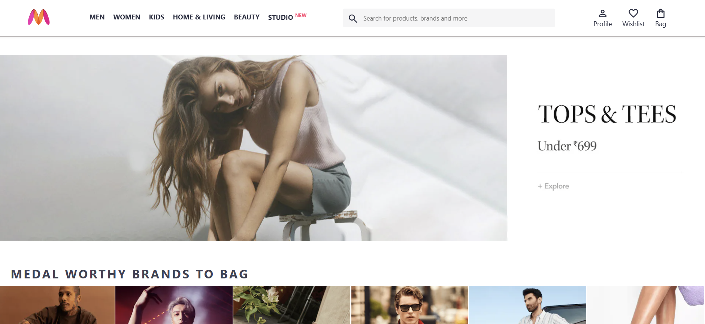
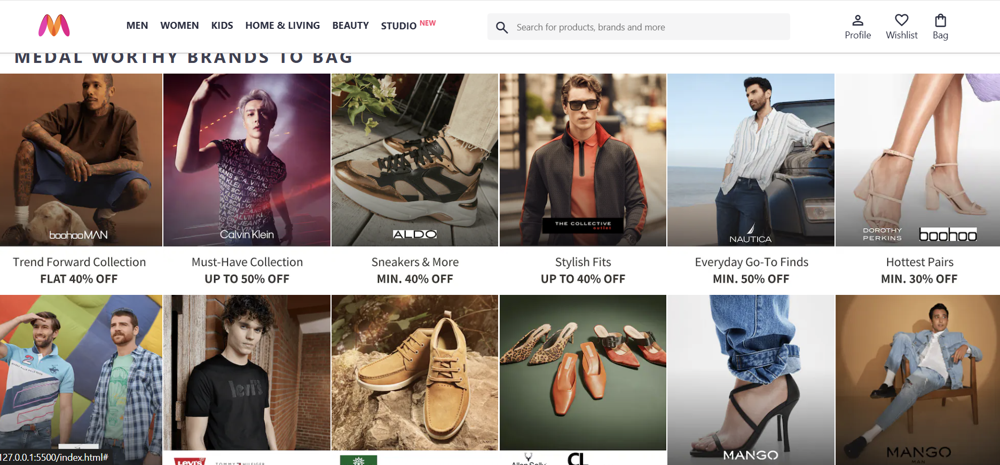
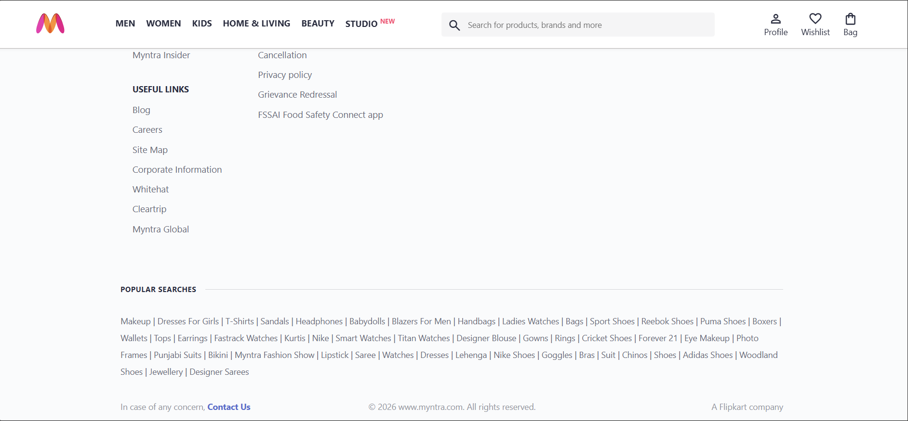

# Myntra Clone (Frontend)

A responsive **Myntra Homepage Clone** built using **HTML and CSS**.  
This project replicates the layout and design of the Myntra landing page, focusing on modern UI practices, Flexbox layout, and responsive design.

---

## 🚀 Features

- Sticky navigation header
- Responsive layout using Flexbox
- Search bar with Material Icons
- Banner section
- Product category sections
- Complete footer with:
  - Shopping links
  - Customer policies
  - App download section
  - Social media icons
  - Popular searches
- Hover effects for navigation and links
- Clean and structured UI similar to Myntra

---

## 🛠️ Tech Stack

- HTML5  
- CSS3 (Flexbox, Media Queries)  
- Google Material Symbols

---

## 📁 Project Structure
myntra-clone/
│
├── index.html
├── style.css
├── images/
│ ├── banner.jpg
│ ├── categories/
│ ├── offers/
│ ├── myntra_logo.webp
│ └── social/app icons
└── README.md


---

## 💻 How to Run Locally

1. Clone the repository

```bash
git clone https://github.com/EKANSHAMAN/myntra-clone

2.Open the project folder

3.Open index.html in your browser

📱 Responsive Design

Navigation menu hides on smaller screens

Footer layout adjusts using Flexbox wrap

Category items align properly on different screen sizes

📸 Screenshots







)
🎯 Learning Outcomes

Page layout structuring

Flexbox alignment techniques

Sticky header implementation

CSS pseudo-elements

Responsive design basics

Real-world UI cloning practice

🌐 Live Demo
https://your-live-link.netlify.app

📄 License

This project is for learning and educational purposes only.