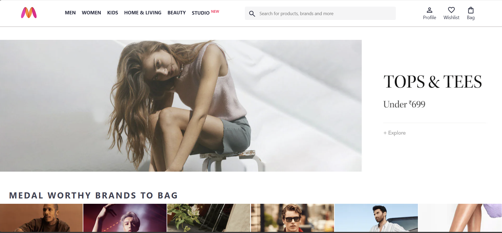
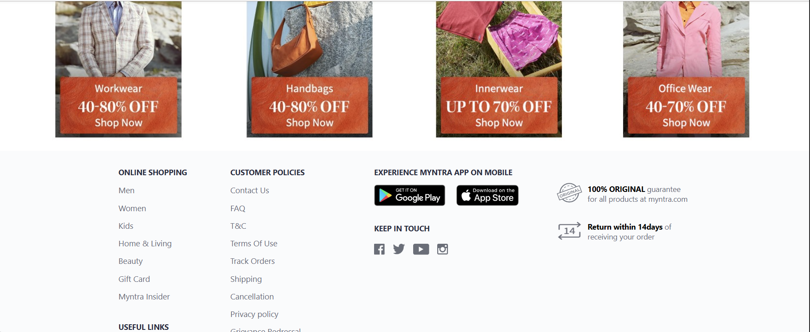

# 🛍️ Myntra Clone (Frontend)

A responsive **Myntra Homepage Clone** built using **HTML and CSS**.
This project replicates the layout and design of the Myntra landing page, focusing on modern UI practices, Flexbox layout, and responsive design.

---

## 🔗 Live Demo

👉 https://ekanshaman.github.io/myntra-clone/

---

## 🚀 Features

* Sticky navigation header
* Responsive layout using **Flexbox**
* Search bar with Google Material Icons
* Promotional banner section
* Category and offer sections
* Complete footer including:

  * Shopping links
  * Customer policies
  * App download buttons
  * Social media icons
  * Popular searches
* Hover effects for better user interaction
* Clean and structured UI inspired by Myntra

---

## 🛠️ Tech Stack

* **HTML5**
* **CSS3**
* Flexbox
* Media Queries (Basic Responsiveness)
* Google Material Symbols

---

## 📁 Project Structure

```
myntra-clone/
│
├── index.html
├── style.css
├── images/
│   ├── banner.jpg
│   ├── categories/
│   ├── offers/
│   ├── myntra_logo.webp
│   └── social & app icons
│
├── screenshots/
└── README.md
```

---

## 💻 Run Locally

1. Clone the repository

```bash
git clone https://github.com/EKANSHAMAN/myntra-clone.git
```

2. Open the project folder

3. Open `index.html` in your browser

---

## 📱 Responsive Behavior

* Navigation menu hides on smaller screens
* Footer adjusts using Flexbox wrap
* Category items align properly on different screen sizes

---

## 📸 Screenshots

### Homepage


### Header



### Footer



---

## 🎯 Learning Outcomes

* Real-world UI cloning practice
* Layout structuring using Flexbox
* Sticky header implementation
* CSS pseudo-elements usage
* Responsive design fundamentals
* Clean component-based styling approach

---

## 🔮 Future Improvements

* Convert project to React
* Add product listing page
* Implement search functionality
* Add cart and wishlist features
* Fully mobile responsive design
* Deploy on Netlify / Vercel

---

## 📄 License

This project is created for **learning and educational purposes only**.
